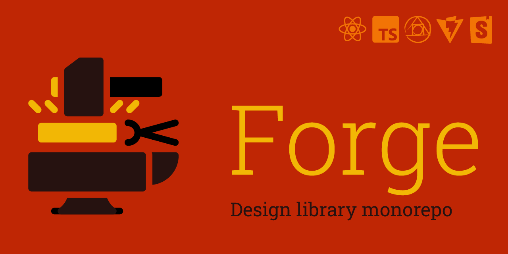

# Forge design library template

**Forge** is a monorepo template. Its purpose is a design library creation and distribution. 

## Technologies used

- [Vite](https://vitejs.dev/) - modern fast app bundler.
- Languages: [Javascript](https://developer.mozilla.org/en-US/docs/Web/JavaScript), [Typescript](https://www.typescriptlang.org/), modern [CSS](https://developer.mozilla.org/en-US/docs/Web/CSS) with [CSS Nesting Module](https://drafts.csswg.org/css-nesting-1/) support via [PostCSS plugin](https://github.com/csstools/postcss-plugins/tree/main/plugins/postcss-nesting).
- [React](https://reactjs.org/) - library to build interface.
- [Storybook](https://storybook.js.org/) -  front end workshop to develop components in isolation.
